# Abschlussbericht

## WiFi Pineapple, Rogue Access Point und ARP Spoofing

**Modul:** Informationssicherheit<br>
**Projektaufgabe:** Nr. 2<br>
**Hochschule:** HTW Berlin<br>
**Gruppe:** Gruppe 1<br>
**Bearbeitungszeitraum:** Sommersemester 2026<br>
**Autoren:** [PLATZHALTER: Dario Vujnovic 594272 aller Gruppenmitglieder ergänzen]<br>


## 1. Ziel des Projekts

Ziel des Projekts ist die praktische Untersuchung von zwei Angriffen auf WLAN und lokale Netzwerke. Dabei werden ein Rogue Access Point als externer Angriffsvektor und ARP Spoofing als interner Angriffsvektor betrachtet. Beide Versuche werden in einer kontrollierten Testumgebung durchgeführt und anhand von Konfigurationen, Screenshots und Paketaufzeichnungen nachvollziehbar beschrieben.

Beim ersten Angriffsvektor wird mit einem WiFi Pineapple Mark VII ein WLAN Zugangspunkt mit der SSID `HTW-Guest` eingerichtet, der ein bekanntes Netz nachahmt. Untersucht wird, ob sich ein Testgerät mit diesem Zugangspunkt automatisch verbindet und welcher Netzwerkverkehr dieses Geräts dadurch auf Seiten des Zugangspunkts sichtbar und auswertbar wird.

Beim zweiten Angriffsvektor wird ARP Spoofing in einem internen Netzwerk durchgeführt. Untersucht wird, wie sich die Zuordnung zwischen IP Adressen und MAC Adressen durch gezielt gefälschte ARP Antworten beeinflussen lässt und welche Voraussetzungen erfüllt sein müssen, damit der Netzwerkverkehr eines Opfersystems über ein drittes System geführt wird.

Ergänzend werden Schutzmaßnahmen für beide Angriffsszenarien ausgearbeitet. Suricata dient zur Erkennung auffälliger Muster im Netzwerkverkehr. arpwatch ergänzt die Überwachung auf der ARP Ebene. Firewall Regeln, feste ARP Zuordnungen, verwaltete WLAN Profile und weitere technische Maßnahmen werden hinsichtlich ihrer Schutzwirkung eingeordnet. Die Wirksamkeit soll durch einen Vergleich des Zustands vor und nach der jeweiligen Maßnahme dargestellt werden.

Abschließend wird der wirtschaftliche Nutzen der Schutzmaßnahmen anhand des Return on Security Investment bewertet. Als Beispielunternehmen dient die SWDS Werft. Die vorhandene Systemlandschaft, die Geschäftsprozesse und die Netzstruktur bilden die Grundlage der Risikobetrachtung. Nicht vorgegebene finanzielle Werte werden als nachvollziehbare Annahmen ausgewiesen.

Am Ende des Projekts sollen folgende Ergebnisse vorliegen:

1. Beide Angriffsvektoren sind reproduzierbar durchgeführt und durch Screenshots sowie Paketaufzeichnungen belegt.
2. Der aufgezeichnete Netzwerkverkehr zeigt nachvollziehbar, welche Informationen über den jeweiligen Angriffsweg sichtbar werden.
3. Für beide Angriffsvektoren liegt eine begründete Einordnung wirksamer Gegenmaßnahmen vor, ergänzt um einen Vergleich des Zustands vor und nach deren Umsetzung.
4. Für das Beispielunternehmen SWDS Werft liegt eine nachvollziehbare ROSI Berechnung mit ausgewiesenen Annahmen vor.

Alle Versuche werden ausschließlich mit eigenen Testsystemen und innerhalb der vorgesehenen Laborumgebung durchgeführt. Dadurch bleiben die Tests reproduzierbar und auf den festgelegten Projektumfang begrenzt.

## 2. Testumgebung

### 2.1 Verwendeter Aufbau

Für die beiden Angriffsvektoren wurden zwei voneinander getrennte Testbereiche verwendet. Der Rogue Access Point wurde im lokalen Netz des WiFi Pineapple durchgeführt. Das ARP Spoofing wurde in einem internen VirtualBox Netzwerk ausgeführt. Für die Einrichtung und Funktionsprüfung von Suricata wurde zusätzlich eine Ubuntu VM vorbereitet.

#### 2.1.1 Aufbau für den Rogue Access Point

Der WiFi Pineapple Mark VII wurde über ein USB C Datenkabel mit einem Windows 11 Laptop verbunden. Windows erkannte das Gerät als USB Ethernet Adapter. Über diese Verbindung wurde das Webinterface des Pineapple aufgerufen und der Angriff konfiguriert.

Der WiFi Pineapple verwendete auf seiner internen Bridge `br-lan` die Adresse `172.16.42.1/24`. Der Netzwerkadapter des Windows Laptops erhielt für die Verwaltung die Adresse `172.16.42.42`.

Als Zielsystem wurde ein echtes WLAN Endgerät eingesetzt. Nach der Verbindung mit der ausgesendeten SSID `HTW-Guest` erhielt dieses Gerät vom Pineapple die Adresse `172.16.42.154`. Der erzeugte Netzwerkverkehr wurde direkt auf der Bridge `br-lan` des Pineapple aufgezeichnet.

| Komponente | Aufgabe | Adresse |
|---|---|---|
| Windows 11 Laptop | Verwaltung des WiFi Pineapple | `172.16.42.42` |
| WiFi Pineapple Mark VII | Rogue Access Point und Paketaufzeichnung | `172.16.42.1` |
| WLAN Endgerät | Zielsystem des Rogue Access Point Tests | `172.16.42.154` |

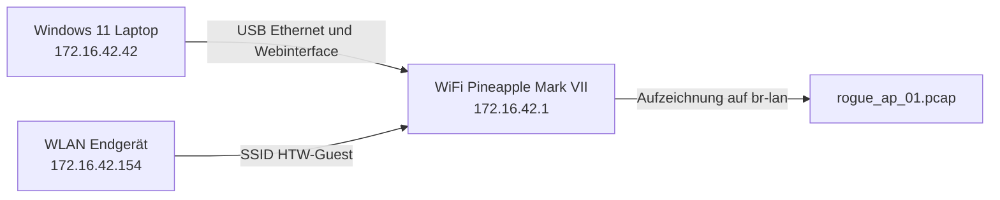
```mermaid
flowchart LR
    Host[Windows 11 Laptop\n172.16.42.42] -->|USB Ethernet und Webinterface| Pineapple[WiFi Pineapple Mark VII\n172.16.42.1]
    Opfer[WLAN Endgerät\n172.16.42.154] -->|SSID HTW-Guest| Pineapple
    Pineapple -->|Aufzeichnung auf br-lan| PCAP[rogue_ap_01.pcap]
```

*Abbildung 1: Verwendeter Aufbau für den Rogue Access Point Test*

> [Als WLAN Endgerät wurde ein Windows-11-Notebook eingesetzt. Es wurden keine Seriennummern oder personenbezogenen Gerätekennungen erfasst.]

#### 2.1.2 Aufbau für das ARP Spoofing

Für den internen Angriff wurde in VirtualBox das Netzwerk `labnet` mit dem Adressbereich `192.168.30.0/24` verwendet. Die Kali VM übernahm die Rolle des Angreifers. Als Zielsystem wurde die Windows VM mit der Adresse `192.168.30.20` verwendet. Das Gateway wurde unter der Adresse `192.168.30.1` angesprochen.

Kali sendete gefälschte ARP Antworten an das Windows System und an das Gateway. Dafür wurde auf Kali die IP Weiterleitung aktiviert. Die beiden `arpspoof` Prozesse liefen gleichzeitig auf dem Interface `eth0`.

| Komponente | Aufgabe | Adresse |
|---|---|---|
| Kali Linux VM | Angreifer und vorgesehene Zwischenstation | `192.168.30.10` |
| Windows 10 VM | Zielsystem des ARP Spoofing Tests | `192.168.30.20` |
| Gateway | Kommunikationspartner des Windows Systems | `192.168.30.1` |

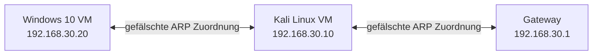
```mermaid
flowchart LR
    Windows[Windows 10 VM\n192.168.30.20] <-->|gefälschte ARP Zuordnung| Kali[Kali Linux VM\n192.168.30.10]
    Kali <-->|gefälschte ARP Zuordnung| Gateway[Gateway\n192.168.30.1]
```

*Abbildung 2: Verwendeter Aufbau für den ARP Spoofing Test*

> [PLATZHALTER: Bezeichnung, Gerätetyp und ?MAC Adresse? des unter `192.168.30.1` eingesetzten Gateways ergänzen.]

#### 2.1.3 Aufbau für die Angriffserkennung

Im internen Testnetz wurde eine Ubuntu Server VM mit der Adresse `192.168.30.2` eingerichtet. Für die Installation, den Smoke Test und die Entwicklung der Suricata Regeln wurde zusätzlich eine gesonderte Ubuntu Umgebung verwendet. Beide Ubuntu Umgebungen werden in Abschnitt 2.2.2 beschrieben. Die Suricata Regeln und ihre vorgesehene Anwendung werden im Kapitel zu den Schutzmaßnahmen theoretisch erläutert.

| Komponente | Aufgabe | Adresse |
|---|---|---|
| Ubuntu Server VM | Für das interne Testnetz bereitgestellt | `192.168.30.2` |
| Kali Linux VM | Erzeugung des internen Angriffsverkehrs | `192.168.30.10` |
| Windows 10 VM | Zielsystem im internen Netz | `192.168.30.20` |

### 2.2 Virtuelle Maschinen

Für den Aufbau der virtuellen Maschinen wurde VirtualBox verwendet. Bei einer ersten Installation ohne Administratorrechte standen im Netzwerk-Manager nur die Adaptertypen NAT und Netzwerkbrücke zur Verfügung. Der für den Testaufbau benötigte Adaptertyp Internes Netzwerk fehlte dabei. Nach einer Neuinstallation von VirtualBox mit Administratorrechten standen alle Adaptertypen zur Verfügung.

#### 2.2.1 Kali Linux als Angriffssystem

Die Kali VM wurde in VirtualBox erstellt. Als Installationsmedium wurde `kali-linux-2026.2-installer-amd64.iso` verwendet.

| Einstellung | Wert |
|---|---|
| Name | Kali Angreifer |
| Betriebssystem | Debian 64 Bit |
| Arbeitsspeicher | 4096 MB |
| Prozessoren | 2 |
| Virtuelle Festplatte | 25 GB, dynamisch |
| Desktop | Xfce |
| Netzwerkadapter | Internes Netzwerk `labnet` |

Der grafische Installer blieb bei einem ersten Versuch während der Partitionierung stehen. Danach wurde der Text Installer verwendet. Als Systemsprache wurde Englisch gewählt. Standort und Tastatur wurden auf Deutschland eingestellt. Die Festplatte wurde automatisch partitioniert. Xfce, die Standardwerkzeuge und die wichtigsten Kali Werkzeuge wurden installiert. Der Bootloader wurde auf `/dev/sda` eingerichtet.

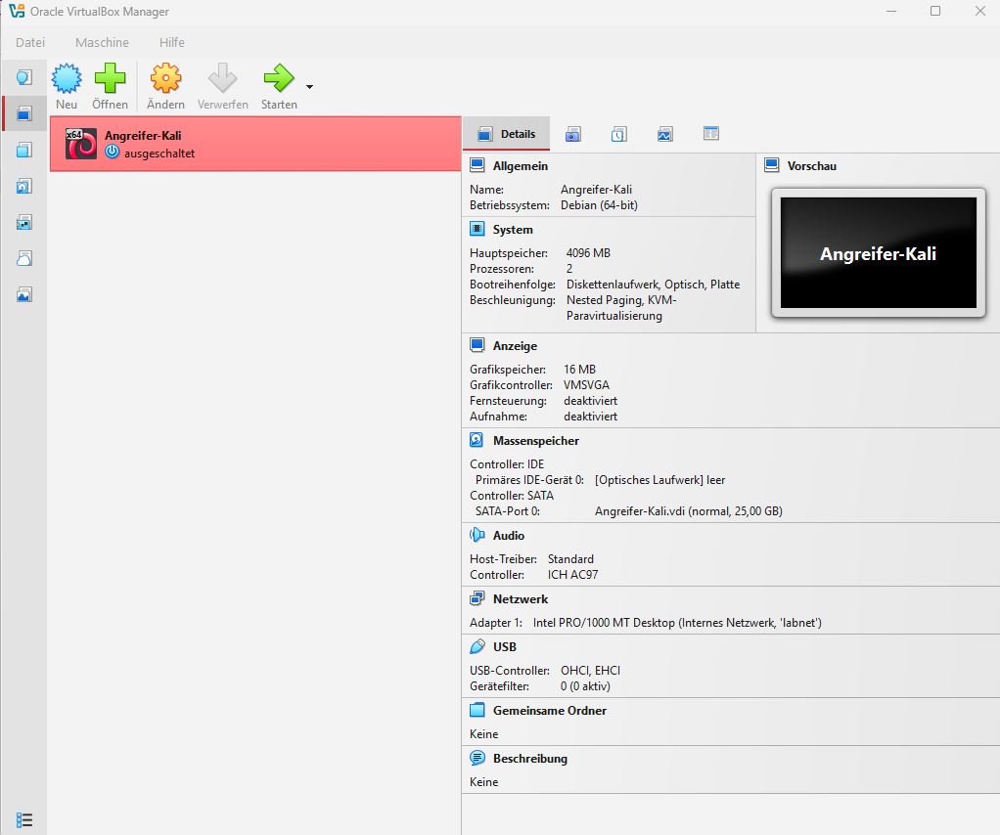

*Abbildung 3: Einstellungen der Kali VM*

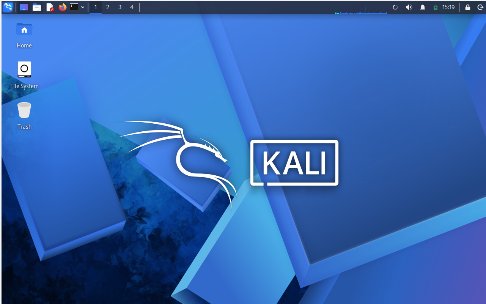

*Abbildung 4: Kali nach abgeschlossener Installation*

#### 2.2.2 Ubuntu Server für Suricata

Für die Arbeit mit Ubuntu wurden zwei Umgebungen eingerichtet. Eine Ubuntu Server VM wurde in VirtualBox mit 2048 MB Arbeitsspeicher, zwei Prozessoren, einer 20 GB Festplatte und dem Interface `enp0s3` angelegt. Als Installationsmedium wurde Ubuntu 26.04 verwendet.

Für die Installation und den Smoke Test von Suricata 8.0.5 wurde außerdem Ubuntu Server 24.04 in UTM auf einem Mac mit Apple Silicon eingesetzt. Diese VM verwendete das Interface `enp0s1` und erhielt im NAT Netz zunächst die Adresse `192.168.64.2`.

Die VirtualBox Umgebung wurde für das interne Netzwerk vorbereitet. Die UTM Umgebung wurde für die Installation und grundsätzliche Funktionsprüfung von Suricata verwendet.

| Einstellung der VirtualBox VM | Wert |
|---|---|
| Name | Ubuntu Suricata |
| Arbeitsspeicher | 2048 MB |
| Prozessoren | 2 |
| Virtuelle Festplatte | 20 GB, dynamisch |
| Netzwerkadapter | Internes Netzwerk `labnet` |
| Adresse im internen Testnetz | `192.168.30.2` |

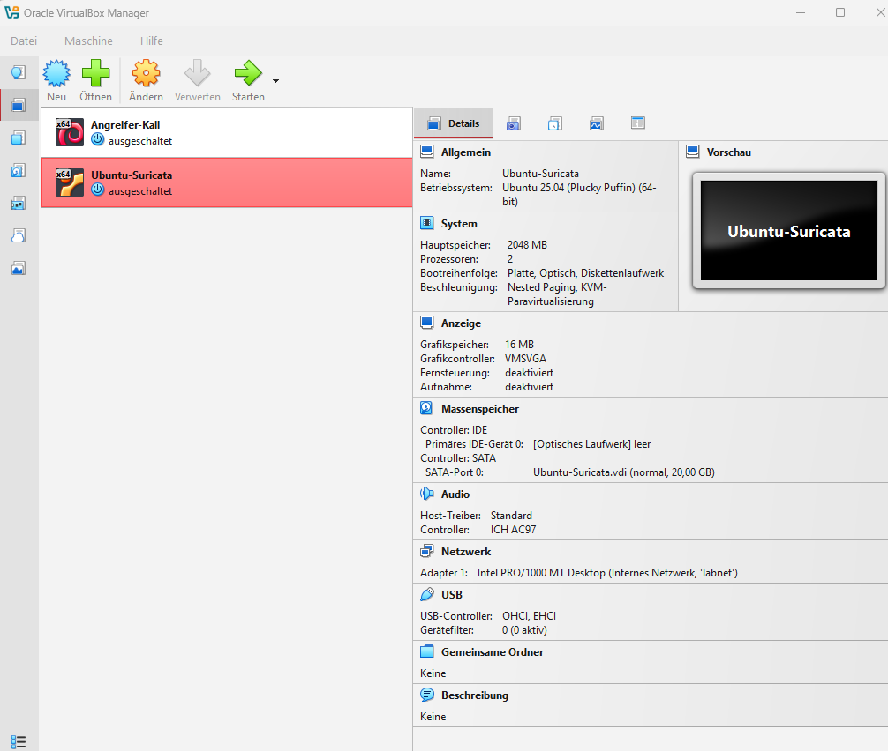

*Abbildung 5: Einstellungen der Ubuntu VM in VirtualBox*

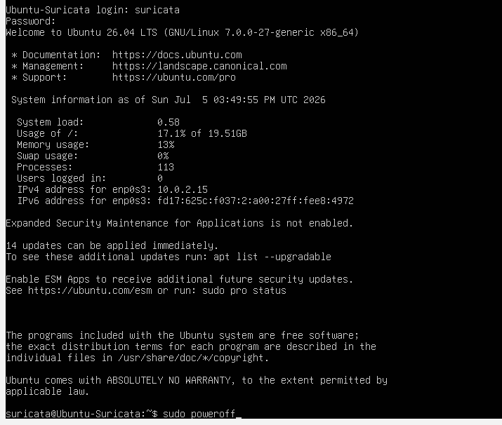

*Abbildung 6: Ubuntu nach abgeschlossener Installation*

#### 2.2.3 Windows 10 als internes Testsystem

Die Windows VM wurde in VirtualBox mit einem über das Microsoft Media Creation Tool erstellten Windows 10 Installationsmedium eingerichtet.

| Einstellung | Wert |
|---|---|
| Name | Windows Opfer |
| Betriebssystem | Windows 10 64 Bit |
| Arbeitsspeicher | 4096 MB |
| Prozessoren | 2 |
| Virtuelle Festplatte | 50 GB, dynamisch |
| Netzwerkadapter | Internes Netzwerk `labnet` |

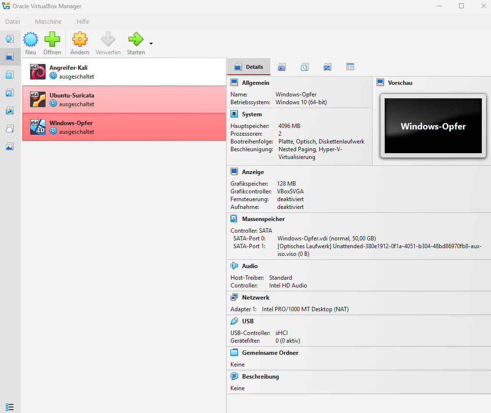

*Abbildung 7: Einstellungen der Windows VM*

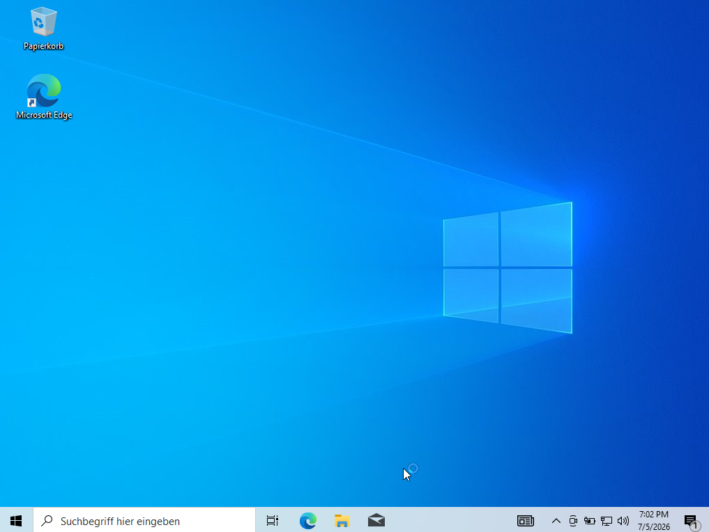

*Abbildung 8: Windows nach abgeschlossener Installation*

Die Windows VM verwendete eine virtuelle Ethernet Verbindung zum internen Netzwerk. Für den WLAN Versuch wurde ein echtes Endgerät mit WLAN Schnittstelle eingesetzt.

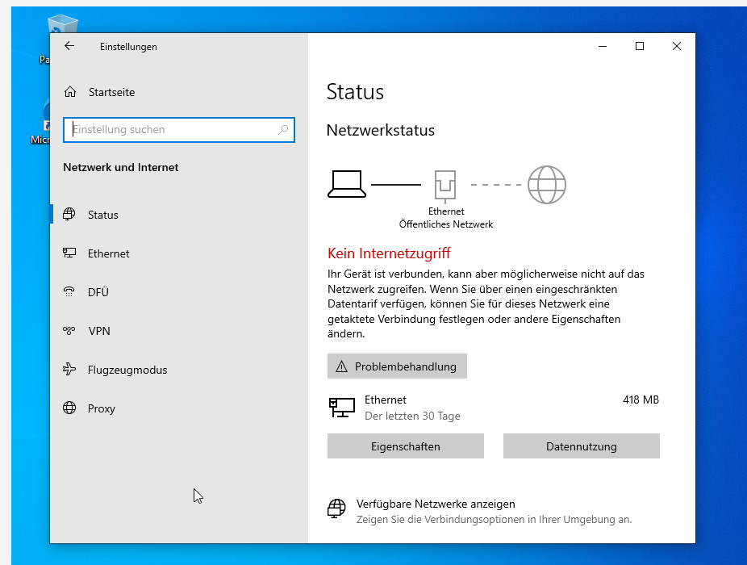

*Abbildung 9: Windows VM ohne nutzbaren WLAN Adapter*

Beim Rogue Access Point diente das echte WLAN Endgerät als Zielsystem. Beim ARP Spoofing wurde die Windows VM unter `192.168.30.20` als internes Zielsystem verwendet.

> [PLATZHALTER:Bei dem echten WLAN Endgerät handelte es sich um ein Windows-11-Notebook.]

### 2.3 Adressen und Verbindungstests

#### 2.3.1 Kali konfigurieren

Kali erhielt die feste Adresse `192.168.30.10`. Die dauerhafte Konfiguration wurde in `/etc/network/interfaces` eingetragen.

```text
auto eth0
iface eth0 inet static
    address 192.168.30.10
    netmask 255.255.255.0
    gateway 192.168.30.1
```

Während der Einrichtung wurde die Adresse zusätzlich direkt gesetzt.

```bash
sudo ip addr add 192.168.30.10/24 dev eth0
ip a
```

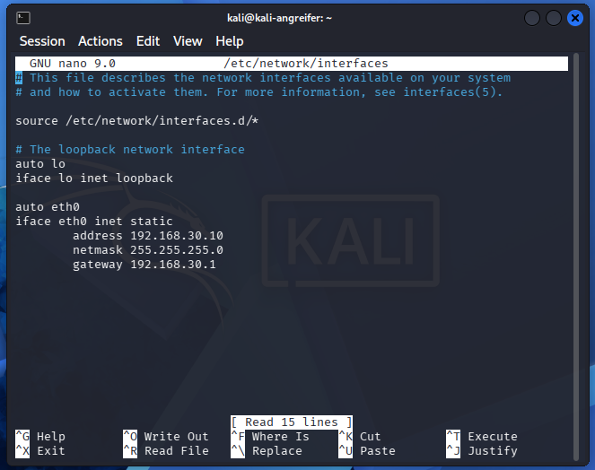

*Abbildung 10: Konfiguration der Kali Adresse*

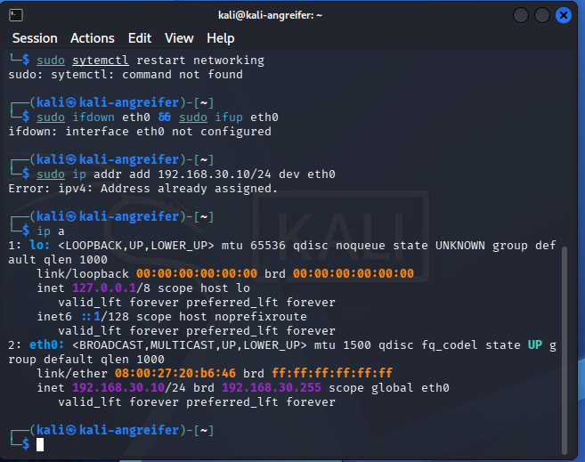

*Abbildung 11: Kontrolle der Kali Adresse mit ip a*

Nach einem Neustart war die Adresse weiterhin vorhanden.

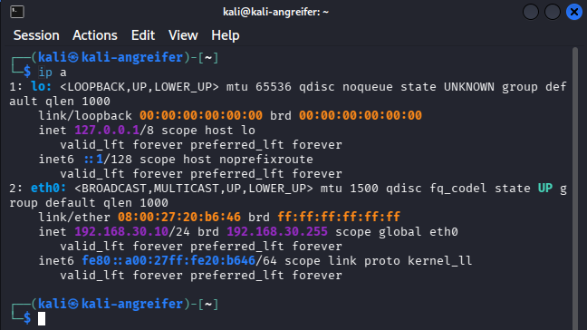

*Abbildung 12: Kali nach dem Neustart mit statischer Adresse*

#### 2.3.2 Ubuntu konfigurieren

Die dauerhafte Adresskonfiguration der VirtualBox Ubuntu VM wurde mit Netplan umgesetzt. Damit erhielt Ubuntu eindeutig die Adresse `192.168.30.2`, während `192.168.30.20` dem Windows Testsystem zugeordnet blieb. Die Datei `/etc/netplan/50-cloud-init.yaml` enthielt folgende Konfiguration.

```yaml
network:
  version: 2
  ethernets:
    enp0s3:
      addresses:
        - 192.168.30.2/24
      routes:
        - to: default
          via: 192.168.30.1
```

Danach wurden die Dateirechte angepasst und die Konfiguration angewendet.

```bash
sudo chmod 600 /etc/netplan/50-cloud-init.yaml
sudo netplan apply
ip a
```

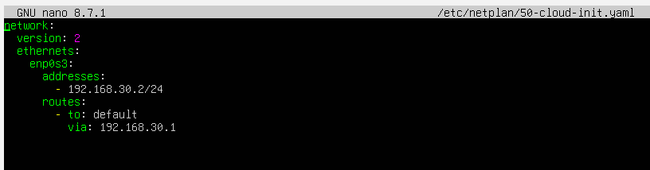

*Abbildung 13: Netplan Konfiguration der Ubuntu Adresse*

Nach einem Neustart wurde die Adresse erneut kontrolliert.

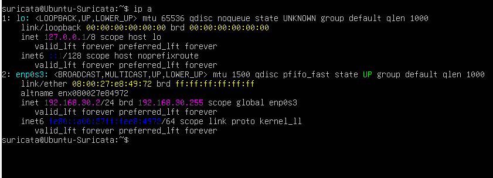

*Abbildung 14: Ubuntu nach dem Neustart mit statischer Adresse*

Die UTM Umgebung verwendete `enp0s1`. In der vorbereiteten Suricata Konfiguration wurde zunächst `eth0` als Aufzeichnungsschnittstelle eingetragen. Für den Einsatz im internen Testnetz wird der Eintrag auf den Namen der verwendeten Schnittstelle abgestimmt.

> [PLATZHALTER: Tatsächlichen Interface Namen der finalen Suricata VM eintragen und `suricata.yaml` entsprechend anpassen.]

#### 2.3.3 Windows konfigurieren

Unter Windows wurde `ncpa.cpl` geöffnet. In den Eigenschaften des Ethernet Adapters wurde unter IPv4 folgende Konfiguration eingetragen.

| Einstellung | Wert |
|---|---|
| IP Adresse | `192.168.30.20` |
| Subnetzmaske | `255.255.255.0` |
| Standardgateway | `192.168.30.1` |

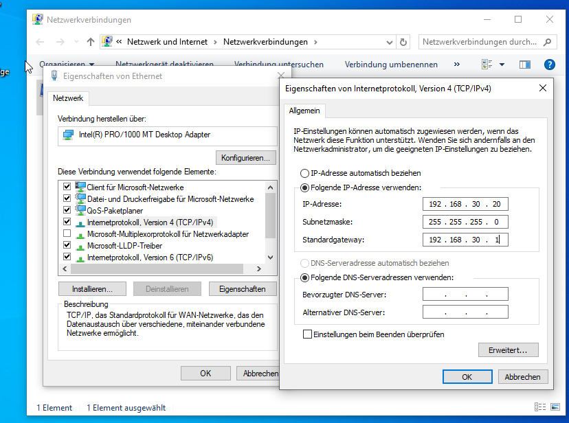

*Abbildung 15: Statische Adresse der Windows VM*

#### 2.3.4 Verbindungstests

Von Kali wurden Ubuntu und Windows mit jeweils drei ICMP Paketen geprüft.

```bash
ping -c 3 192.168.30.2
ping -c 3 192.168.30.20
```

Ubuntu war direkt erreichbar. Für Windows wurde eine Firewall Regel für eingehende ICMP Anfragen eingerichtet. Außerdem wurde der Name des internen Netzwerks einheitlich auf `labnet` gesetzt. Danach waren beide Systeme von Kali erreichbar.

```text
netsh advfirewall firewall add rule name="ICMP" protocol=icmpv4:8,any dir=in action=allow
```

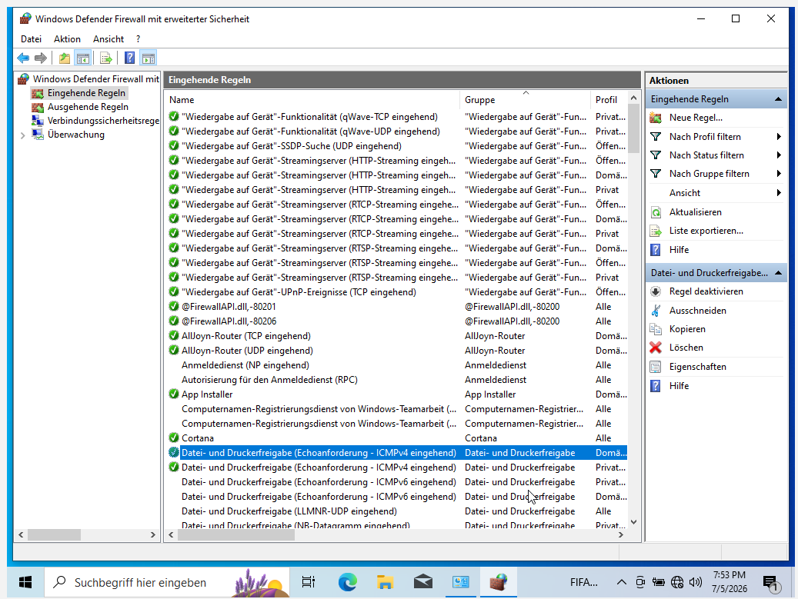

*Abbildung 16: Zusätzliche Windows Firewall Regel für ICMP*

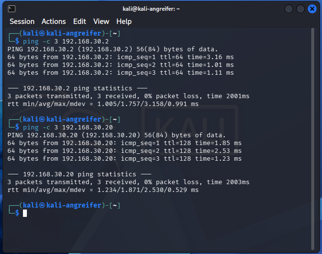

*Abbildung 17: Erfolgreiche Ping Tests zu Ubuntu und Windows*

Der Verbindungstest bestätigt die Erreichbarkeit der Adressen `192.168.30.2` und `192.168.30.20` von Kali.

> [PLATZHALTER: Ergebnis des Verbindungstests von Kali zum Gateway `192.168.30.1` ergänzen.]

## 3. Vorbereitung der Werkzeuge

In diesem Kapitel stehen nur Werkzeuge und Einstellungen, die für mehrere Teile des Projekts benötigt wurden. Die Einrichtung des WiFi Pineapple steht direkt bei Angriffsvektor 1. `arpspoof` und die IP Weiterleitung stehen direkt bei Angriffsvektor 2.

### 3.1 Wireshark

Wireshark wurde für die Kontrolle des internen Verkehrs und die spätere Auswertung der Pineapple PCAP verwendet. Für eine mögliche Installation wurde der Adapter der Kali VM vorübergehend auf NAT gestellt, da `labnet` keinen Internetzugang hatte.

```bash
sudo ip addr flush dev eth0
sudo ip link set eth0 down
sudo ip link set eth0 up
sudo dhcpcd eth0
sudo apt update
sudo apt install wireshark -y
```

Bei der Installationsprüfung zeigte sich, dass Wireshark bereits in Kali enthalten war. Nach der Kontrolle wurde der Netzwerkadapter wieder auf `labnet` gestellt.

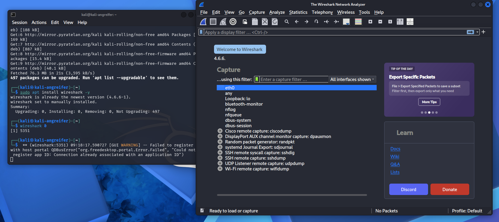

*Abbildung 18: Wireshark auf der Kali VM*

### 3.2 Suricata als gemeinsame Erkennungsgrundlage

Suricata dient zur Auswertung der Folgen beider Angriffsvektoren. Für den Rogue Access Point wurden Regeln für Klartext HTTP vorbereitet. Für das ARP Spoofing wurden Regeln für DNS Verkehr und eine Ergänzung durch arpwatch vorbereitet.

Die Installation erfolgte über die stabile OISF Paketquelle.

```bash
sudo add-apt-repository ppa:oisf/suricata-stable -y
sudo apt update
sudo apt install suricata -y
sudo suricata-update
```

Anschließend wurde die Konfiguration geprüft und der Dienst gestartet.

```bash
sudo suricata -T -c /etc/suricata/suricata.yaml -v
sudo systemctl enable suricata
sudo systemctl restart suricata
sudo systemctl status suricata
```

Ein allgemeiner Smoke Test rief `testmynids.org` auf. Im Kurzprotokoll erschien der Alert `GPL ATTACK_RESPONSE id check returned root`.

```bash
curl http://testmynids.org/uid/index.html
sudo tail /var/log/suricata/fast.log
```

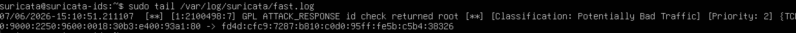

*Abbildung 19: Aufruf der Testseite für den Suricata Smoke Test*

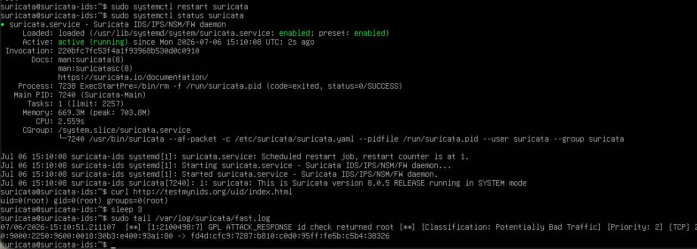

*Abbildung 20: Suricata Dienst und ausgelöster Smoke Test Alert*

Ein weiterer Screenshot zeigt einen zu diesem Zeitpunkt erfolgreichen Konfigurationstest mit null fehlgeschlagenen Regeln.

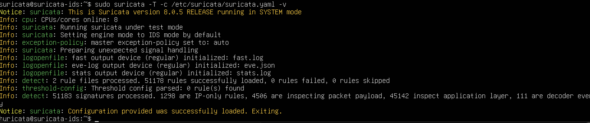

*Abbildung 21: Erfolgreicher Suricata Konfigurationstest zum Zeitpunkt der Aufnahme*

Der Smoke Test bestätigt die grundsätzliche Funktion der verwendeten Suricata Umgebung. Für die Erkennung der beiden Projektangriffe wurde zusätzlich die Regeldatei `local.rules` vorbereitet. Der Konfigurationstest wurde fehlerfrei abgeschlossen und alle eigenen Regeln wurden geladen.

> [PLATZHALTER: Prüfen, ob Abbildung 21 vor dem Hinzufügen von Regel R4 zu `local.rules` entstanden ist. Der fehlende Klammerabschluss in R4 war ein Tippfehler beim Erstellen der Regel, dieser hätte beim Laden nur zu einer fehlgeschlagenen Regel geführt, nicht zu null fehlgeschlagenen.]

## 4. Angriffsvektor 1: Rogue Access Point

### 4.1 Ziel und Funktionsprinzip

Ein Rogue Access Point ist ein nicht autorisierter WLAN Zugangspunkt. In diesem Versuch sendete der WiFi Pineapple die bekannte SSID `HTW-Guest` aus. Als Vergleichsnetz wurde ein eigener mobiler Hotspot verwendet.

Ein vollständiger Evil Twin verwendet denselben Namen und eine passende Sicherheitskonfiguration. Im ersten Test wurde eine offene Kopie der SSID eingerichtet. Der mobile Testhotspot verwendete WPA2. Eine mögliche Konfiguration mit passender WPA2 Absicherung wird in Abschnitt 4.9 ergänzt.

> **@alle: Bitte diesen Abschnitt prüfen und bei Bedarf an den tatsächlich durchgeführten Ablauf anpassen.**
>
> Aktuell muss eindeutig zwischen dem ersten Test mit Open AP und der späteren Verbindung über Evil WPA unterschieden werden. Im ersten Test wurde mit der Funktion Open AP lediglich die SSID `HTW-Guest` übernommen. Das Kennwort des ursprünglichen Hotspots wurde dabei nicht übernommen. Der echte mobile Hotspot verwendete WPA2 und ein Kennwort. Der Open AP des WiFi Pineapple wurde dagegen unverschlüsselt ausgesendet. Ein Endgerät mit einem gespeicherten WPA2 Profil verbindet sich normalerweise nicht automatisch mit einer offenen Variante derselben SSID.
>
> Abbildung 28 (rogue_openap_configure_04.png) belegt den ersten Test. Im Screenshot ist der Reiter `Open AP` ausgewählt. Als `Open SSID` ist `HTW-Guest` eingetragen. Die Oberfläche weist darauf hin, dass dieser Zugangspunkt ohne Verschlüsselung ausgesendet wird. Ein Feld für ein WLAN Kennwort ist nicht vorhanden. Damit zeigt die Abbildung, dass in diesem Schritt nur der Netzwerkname und nicht das Kennwort übernommen wurde.
>
> Für die spätere erfolgreiche Verbindung mit der Adresse `172.16.42.154` wurde laut Versuchsbericht Evil WPA mit passender WPA2 Konfiguration verwendet. Bitte bestätigen, ob dabei dieselbe Passphrase wie beim mobilen Testhotspot eingetragen wurde und ob sich das Endgerät automatisch verbunden hat oder die Verbindung manuell bestätigt wurde. Anschließend sollten die Beschreibung in diesem Abschnitt und Abschnitt 4.9 entsprechend vereinheitlicht werden.

Damit sich das Testgerät beim eigentlichen Termin automatisch mit dem vom Pineapple gesendeten Netz verbindet, wurde vorab ein persönlicher Hotspot mit dem Namen `HTW-Guest` und WPA2 Absicherung eingerichtet. Das Testgerät verband sich einmalig mit diesem Hotspot und speicherte das Netz dadurch als bekannt. Anschließend wurde der Hotspot wieder deaktiviert. Beim späteren Pineapple Termin sendete der WiFi Pineapple dieselbe SSID aus, wodurch sich das Testgerät ohne manuelles Zutun automatisch verband.

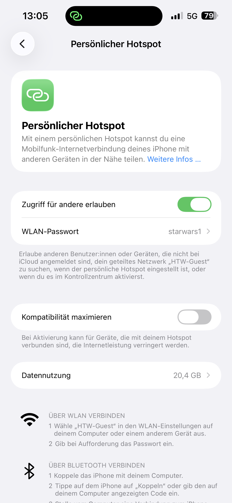

*Abbildung 22: Einrichtung des persönlichen Hotspots als bekanntes Vergleichsnetz*

### 4.2 WiFi Pineapple anschließen

Der WiFi Pineapple Mark VII wurde über ein USB C Datenkabel mit einem Windows 11 Laptop verbunden. Nach ungefähr einer Minute erkannte Windows einen ASIX USB Ethernet Adapter. Für diesen Adapter wurde folgende IPv4 Konfiguration gesetzt.

| Feld | Wert |
|---|---|
| IP Adresse | `172.16.42.42` |
| Subnetzmaske | `255.255.0.0` |
| Standardgateway | leer |
| Bevorzugter DNS Server | `8.8.8.8` |
| Alternativer DNS Server | `8.8.4.4` |

Danach war das Webinterface unter `http://172.16.42.1:1471` erreichbar.

### 4.3 Passwort zurücksetzen und anmelden

Vor der Einrichtung wurde das Zugangspasswort des WiFi Pineapple zurückgesetzt. Dafür wurde der Reset Taster ungefähr zehn Sekunden gedrückt. Die farbig blinkende LED zeigte den erfolgreichen Vorgang an. Nach dem Neustart wurde das Webinterface erneut geöffnet und unter `Settings` und `User Management` ein neues Passwort vergeben. Zugangsdaten werden aus Sicherheitsgründen nicht im Abschlussbericht veröffentlicht.

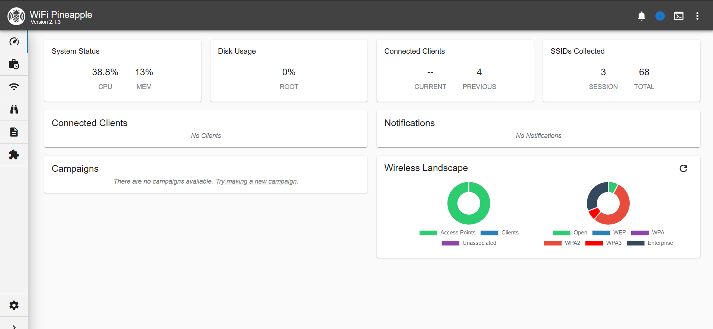

*Abbildung 23: Dashboard nach erfolgreicher Anmeldung am WiFi Pineapple*

### 4.4 Schnittstellen prüfen

Im Web Terminal wurde `ip a` ausgeführt. Die Bridge `br-lan` trug die Adresse `172.16.42.1/24`. `eth0`, `wlan0` und `wlan0-1` waren der Bridge zugeordnet. `wlan1` wurde als Recon Interface verwendet. `wlan2` war nicht aktiv.

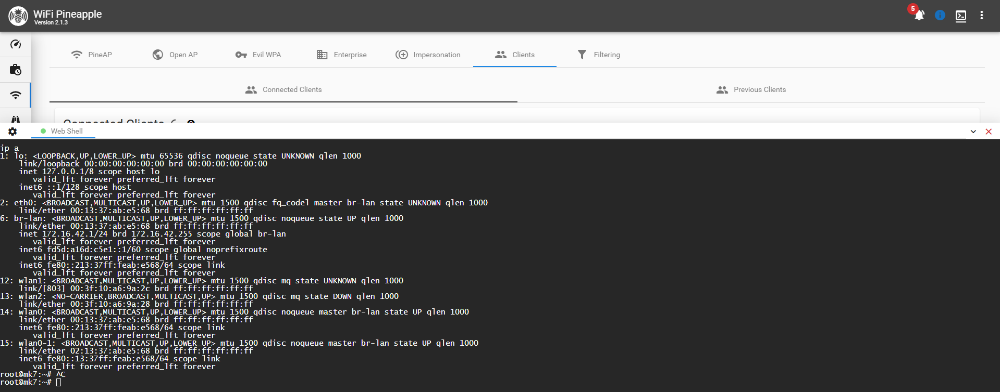

*Abbildung 24: Netzwerkschnittstellen des WiFi Pineapple*

Diese Kontrolle war später wichtig, weil `br-lan` als Aufzeichnungsschnittstelle für `tcpdump` verwendet wurde.

### 4.5 WLAN Umgebung mit Recon erfassen

Im Webinterface wurde die Recon Ansicht geöffnet. Im Bereich `Scanning` wurde ein Scan über 30 Sekunden gestartet. Die Liste zeigte SSID, BSSID, Hersteller, Anzahl der Clients, Sicherheitsverfahren, Kanal und Signalstärke.

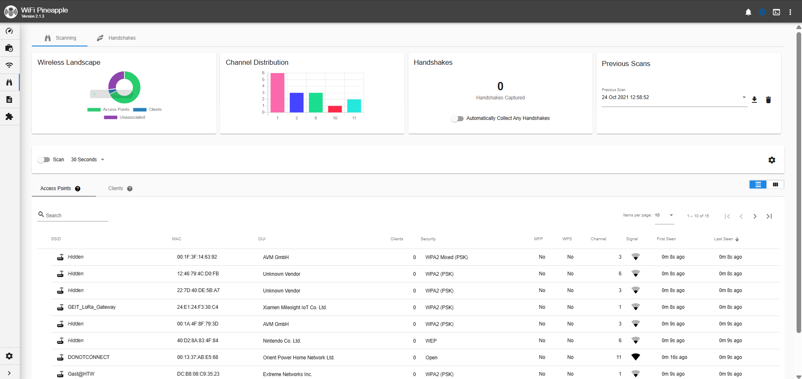

*Abbildung 25: Recon Scan der WLAN Umgebung*

Zu Beginn wurde der Eintrag `Gast@HTW` untersucht. Anschließend wurde die Auswahl auf das vorgesehene Testnetz `HTW-Guest` korrigiert. Die beiden Namen bezeichnen unterschiedliche Netze.

| SSID | Sichtbare Angaben | Einordnung |
|---|---|---|
| `Gast@HTW` | Mehrere BSSIDs von Extreme Networks, WPA2 | Nicht das Testziel |
| `DONOTCONNECT` | BSSID `00:13:37:AB:E5:68`, offen, Kanal 11 | Eigener Pineapple vor der Umbenennung |
| `GEIT_LoRa_Gateway` | BSSID `24:E1:24:F3:30:C4`, WPA2 | Nicht verwendet |
| `HTW-Guest` | BSSID `00:13:37:AB:E5:68`, offen, Kanal 11 | Eigener Pineapple nach der Umbenennung |

Bei einem späteren Scan erschien `HTW-Guest`. Die BSSID stimmte mit der BSSID des Pineapple überein. Damit konnte der Eintrag eindeutig dem eigenen Access Point zugeordnet werden.

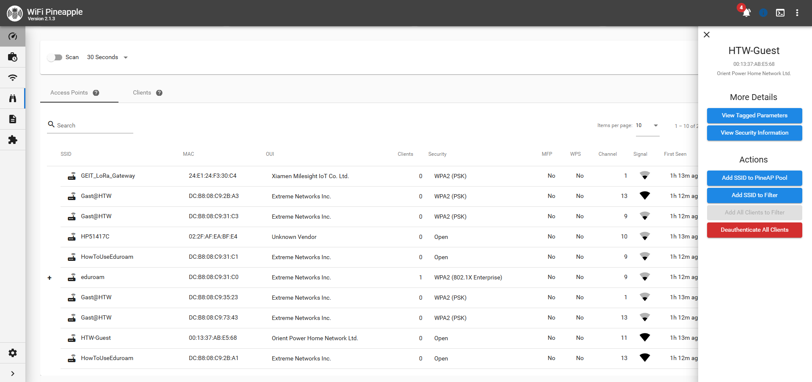

*Abbildung 26: Recon Detailansicht des eigenen Access Points mit dem Namen HTW Guest*

Der Recon Screenshot zeigt den eigenen Access Point mit der SSID `HTW-Guest`. Für eine eindeutige Gegenüberstellung mit dem mobilen Hotspot wird zusätzlich dessen BSSID, Kanal und WPA2 Kennzeichnung benötigt. Das verwendete Recon Interface arbeitete in diesem Aufbau im 2,4 GHz Bereich.

> [PLATZHALTER: Ein gesonderter Recon-Screenshot des mobilen Testhotspots konnte nicht erstellt werden, da dieser im Recon-Scan des Pineapple nicht als eigener Eintrag erschien. Für den Nachweis von Angriffsvektor 1 ist dies nicht erforderlich.]


### 4.6 SSID Pool und PineAP vorbereiten

Durch Anklicken eines Recon Eintrags öffnete sich das Aktionsmenü. Dort standen `Add SSID to PineAP Pool`, Filterfunktionen und `Deauthenticate All Clients` zur Verfügung.

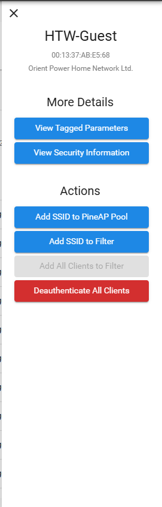

*Abbildung 27: Aktionsmenü für die ausgewählte SSID*

Der Screenshot zeigt die verfügbare Funktion zum Hinzufügen der SSID.

> [PLATZHALTER: > **Noch offen:** Die Aktion "Add SSID to PineAP Pool" wurde für den eigenen Pineapple-Eintrag (Self-MAC `00:13:37:AB:E5:68`) ausgeführt, dabei erschien die Bestätigung "SSID already in PineAP Pool". Ein separater Beleg für den echten mobilen Testhotspot fehlt noch, da dieser im Recon aktuell nicht gefunden wird (siehe Hinweis in Abschnitt 4.5).]

Im erweiterten PineAP Modus wurden folgende Optionen aktiviert.

| Einstellung | Zweck im Versuch |
|---|---|
| Impersonate all networks | Auf Probe Anfragen mit gespeicherten SSIDs antworten |
| Log PineAP Events | PineAP Ereignisse protokollieren |
| Capture SSIDs to Pool | Erkannte SSIDs in den Pool übernehmen |
| Advertise AP Impersonation Pool | SSIDs aus dem Pool aussenden |
| Client Connect Notifications | Neue Verbindungen melden |
| Client Disconnect Notifications | Getrennte Verbindungen melden |

> [PLATZHALTER: 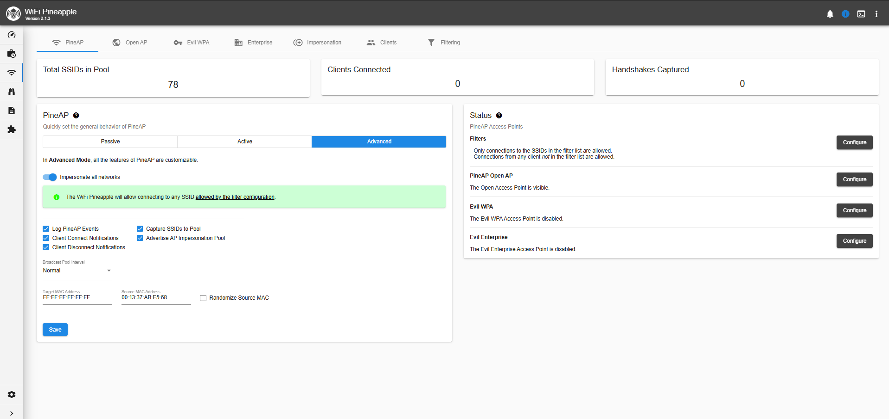


### 4.7 Offenen Access Point konfigurieren

Im Reiter `Open AP` wurde als SSID `HTW-Guest` eingetragen. Kanal 11 mit 2462 MHz war ausgewählt. Die Funktion `Respond to all probe requests` war aktiv. Nach dem Speichern wurde die SSID in der Filterkonfiguration erlaubt.

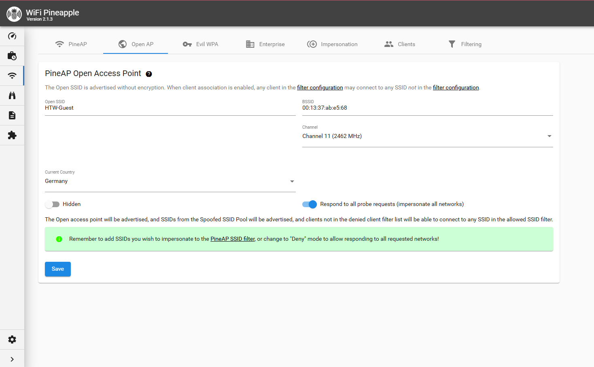

*Abbildung 28: Konfiguration des offenen Access Points HTW Guest*

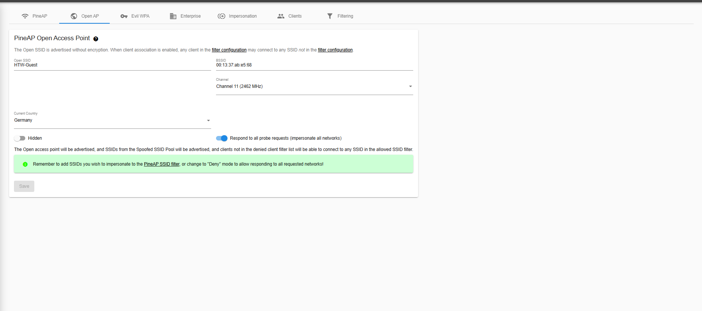

*Abbildung 29: Gespeicherte SSID HTW Guest auf Kanal 11*

Das Statusfeld meldete den offenen Access Point als sichtbar.

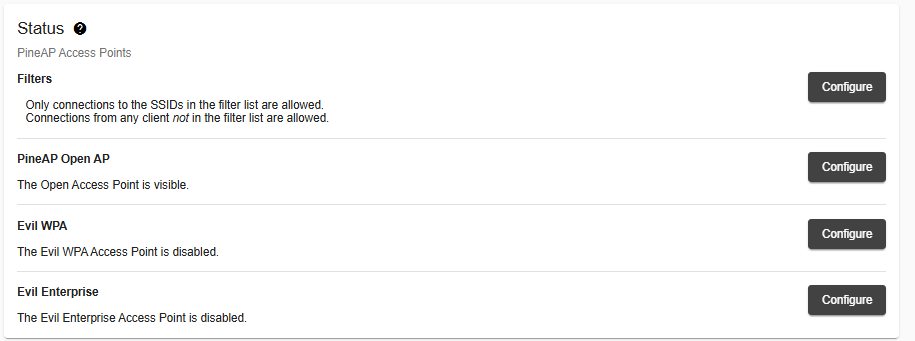

*Abbildung 30: Statusmeldung des sichtbaren offenen Access Points*

Der mobile Testhotspot verwendete WPA2. Der Pineapple Access Point wurde zunächst offen eingerichtet. Der vorhandene Client Screenshot bestätigt die Verbindung mit `HTW-Guest`. Die genaue Art des Verbindungsaufbaus wird in Abschnitt 4.9 ergänzt.

### 4.8 Deauthentication Versuch

Im Aktionsmenü stand `Deauthenticate All Clients` zur Verfügung. Die Funktion wurde zunächst mit dem Eintrag `Gast@HTW` aufgerufen. Beim späteren Aufruf für `HTW-Guest` zeigte die identische BSSID, dass der eigene Pineapple Eintrag ausgewählt war. Für diesen Eintrag wurden keine verbundenen Clients angezeigt.

> [PLATZHALTER: Ein Deauthentication-Test gegen den echten mobilen Testhotspot wurde nicht durchgeführt, da dieser im Recon-Scan nicht erfasst wurde. Für den Nachweis von Angriffsvektor 1 ist dies nicht erforderlich, da die erfolgreiche Verbindung eines Endgeräts und die Aufzeichnung seines Datenverkehrs bereits in den Abschnitten 4.9 bis 4.11 belegt sind.]
### 4.9 Verbindung eines Endgeräts

Ein echtes Endgerät verband sich mit der SSID `HTW-Guest`. Der Screenshot zeigt die IP Adresse `172.16.42.154` und den übertragenen Datenverkehr des verbundenen Geräts.

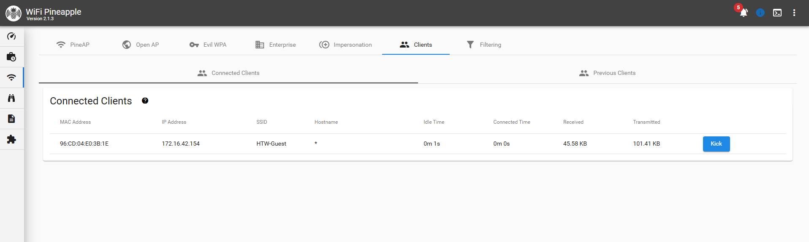

*Abbildung 31: Mit HTW Guest verbundenes Endgerät*

> [PLATZHALTER: Die Verbindung wurde über die Evil-WPA/2-Funktion des WiFi Pineapple hergestellt.]

> [PLATZHALTER:Da der mobile Testhotspot WPA2 verwendete, wurde auch der Pineapple-Access-Point über die Funktion "Clone WPA2 AP" mit identischer SSID (`HTW-Guest`) und WPA2-Verschlüsselung konfiguriert. Dadurch konnte sich das Testgerät mit dem gefälschten Access Point verbinden. Das für die Verbindung verwendete Passwort wird aus Datenschutzgründen nicht dokumentiert.]

### 4.10 Verkehr mit tcpdump aufzeichnen

Da `br-lan` die Access Point Schnittstellen verband, wurde die Aufzeichnung direkt auf dieser Bridge gestartet.

```bash
tcpdump -i br-lan -w /root/rogue_ap_01.pcap
```

Während `tcpdump` lief, wurde am verbundenen Endgerät `neverssl.com` aufgerufen. Dabei wurden DNS Anfragen und Verbindungsversuche erzeugt und aufgezeichnet.

Nach dem Test wurde `tcpdump` mit `Strg+C` beendet. Die Ausgabe zeigte 2100 aufgezeichnete Pakete, 2110 vom Filter empfangene Pakete und null vom Kernel verworfene Pakete.

Die Datei wurde danach von einer Windows PowerShell mit `scp` auf den Laptop übertragen.

```powershell
scp root@172.16.42.1:/root/rogue_ap_01.pcap C:\Users\LaraWurzbacher\Downloads\
```

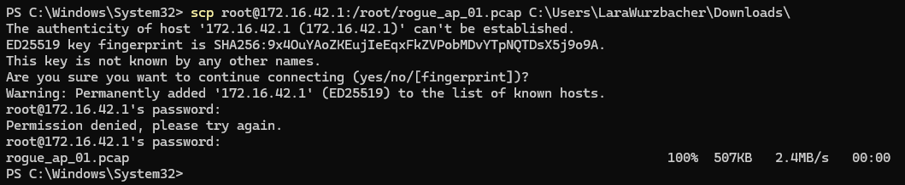

*Abbildung 32: Übertragung der Rogue Access Point PCAP mit scp*

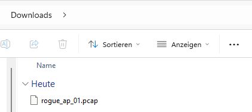

*Abbildung 33: Rogue Access Point PCAP im Download Ordner*

Die Screenshots bestätigen die erfolgreiche Übertragung der Datei `rogue_ap_01.pcap`.

> [PLATZHALTER: Der im Befehl und in Abbildung 32 sichtbare Benutzername wird anonymisiert. Im Text wurde der Pfad auf `C:\Users\[Name]\Downloads\` angepasst; im Screenshot ist der Name entsprechend zu schwärzen.]

> [PLATZHALTER: Die Datei `rogue_ap_01.pcap` wird der Abgabe als Anlage im Ordner `pcaps/` beigefügt.]

### 4.11 PCAP in Wireshark auswerten

Die PCAP wurde in Wireshark geöffnet. Folgender Filter beschränkte die Ansicht auf DNS Anfragen des verbundenen Endgeräts für `neverssl.com`.

```text
dns && ip.addr == 172.16.42.154 && dns.qry.name == "neverssl.com"
```

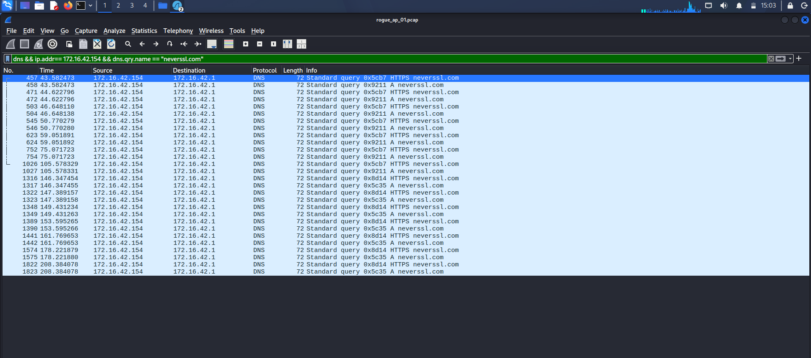

*Abbildung 34: Gefilterte DNS Anfragen des verbundenen Endgeräts*

Die Ansicht zeigt wiederholte DNS Anfragen von `172.16.42.154` an `172.16.42.1`. Damit ist belegt, dass DNS Verkehr des verbundenen Endgeräts auf dem Pineapple aufgezeichnet werden konnte.

Der ausgewertete Bildausschnitt umfasst die DNS Anfragen des Endgeräts. Die Analyse dieses Testschritts konzentriert sich damit auf die Sichtbarkeit der Namensauflösung.

> [PLATZHALTER: Für den Nachweis genügt die Aufzeichnung der DNS-Anfragen. Auf die Aufzeichnung weiterer Inhalte wurde verzichtet.]

### 4.12 Ort der Datenaufzeichnung

Der Datenverkehr des verbundenen WLAN Endgeräts wurde mit `tcpdump` direkt auf der Bridge `br-lan` des WiFi Pineapple aufgezeichnet. Die Paketaufzeichnung wurde unter `/root/rogue_ap_01.pcap` gespeichert.

### 4.13 Ergebnis und Grenzen

Der erste Angriffsvektor weist folgende Punkte nach.

1. Der WiFi Pineapple sendete einen offenen Access Point mit der SSID `HTW-Guest`.
2. Ein echtes Endgerät war mit dieser SSID verbunden.
3. Das Endgerät erhielt eine Adresse aus dem Pineapple Netz.
4. DNS Anfragen des Endgeräts konnten auf dem Pineapple aufgezeichnet werden.

Der vorhandene Nachweis umfasst die Access Point Konfiguration, die Verbindung eines Endgeräts, die Paketaufzeichnung und die Auswertung der DNS Anfragen. Ergänzende Nachweise für Deauthentication, Verbindungsart, Evil WPA und Suricata werden an den gekennzeichneten Platzhaltern eingefügt.

## 5. Angriffsvektor 2: ARP Spoofing

### 5.1 Ziel und Funktionsprinzip

ARP ordnet innerhalb eines lokalen IPv4 Netzes IP Adressen den zugehörigen MAC Adressen zu. Beim ARP Spoofing sendet ein Angreifer falsche Zuordnungen an zwei Kommunikationspartner.

Kali sendet an das Windows Testsystem die Zuordnung der Gateway Adresse `192.168.30.1` zur MAC Adresse von Kali. Gleichzeitig wird an das Gateway die Zuordnung der Windows Adresse `192.168.30.20` zur MAC Adresse von Kali gesendet. Nach der Übernahme dieser Zuordnungen wird der Verkehr beider Kommunikationspartner an Kali adressiert.

| System | Rolle im Versuch | Adresse |
|---|---|---|
| Gateway | Kommunikationspartner des Opfers | `192.168.30.1` |
| Kali | Angreifer und Zwischenstation | `192.168.30.10` |
| Windows | Opfer | `192.168.30.20` |

### 5.2 Voraussetzungen prüfen

Vor dem Angriff wurde auf Kali mit `ip a` kontrolliert, ob `eth0` die Adresse `192.168.30.10/24` verwendete. `arpspoof` war bereits in Kali vorhanden. Das Werkzeug gehört zum Paket `dsniff`.

Für die Reproduktion auf einer neuen Kali Installation kann das Paket mit folgendem Befehl installiert werden.

```bash
sudo apt update
sudo apt install dsniff -y
```

### 5.3 IP Weiterleitung aktivieren

Für die Weiterleitung empfangener Pakete an das eigentliche Ziel wurde vor dem Test die IP Weiterleitung auf Kali aktiviert.

```bash
echo 1 | sudo tee /proc/sys/net/ipv4/ip_forward
cat /proc/sys/net/ipv4/ip_forward
```

Die Ausgabe `1` bestätigte den aktiven Zustand. Die Einstellung war nur bis zum nächsten Neustart gültig.

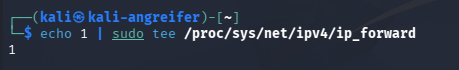

*Abbildung 35: Aktivierte IP Weiterleitung auf Kali*

### 5.4 Gefälschte ARP Antworten senden

Für beide Richtungen wurde ein eigenes Terminal geöffnet.

```bash
sudo arpspoof -i eth0 -t 192.168.30.20 192.168.30.1
sudo arpspoof -i eth0 -t 192.168.30.1 192.168.30.20
```

Der erste Befehl richtete sich an das Opfer `192.168.30.20` und gab die Adresse des Gateways `192.168.30.1` vor. Der zweite Befehl richtete sich an `192.168.30.1` und gab die Adresse des Opfers vor.

Ein erster Start ohne `sudo` scheiterte mit dem Hinweis, dass Root Rechte oder `CAP_NET_RAW` erforderlich seien. Nach dem Start mit `sudo` sendete das Werkzeug fortlaufend ARP Antworten.

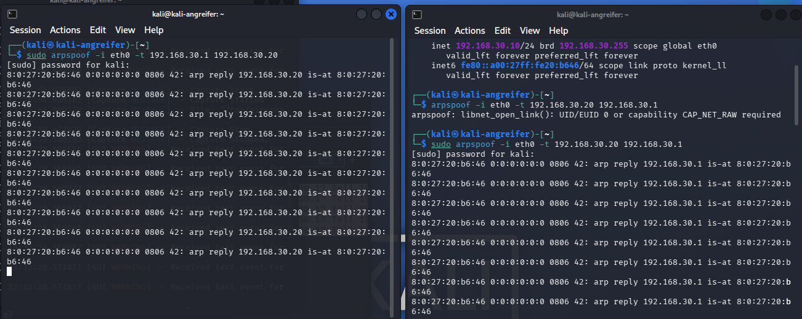

*Abbildung 36: Zwei laufende arpspoof Prozesse für beide Kommunikationsrichtungen*

Der Screenshot zeigt die erzeugten Antworten `192.168.30.1 is-at ...` und `192.168.30.20 is-at ...`. Damit ist das Senden der gefälschten Antworten für beide Kommunikationsrichtungen nachvollziehbar.

> [PLATZHALTER: Das erfolgreiche Senden der gefälschten ARP-Antworten in beide Richtungen ist durch die Terminal-Ausgabe in Abbildung 36 belegt. ]
### 5.5 Verkehr aufzeichnen

Für die Paketaufzeichnung wird Wireshark auf Kali mit `eth0` als Schnittstelle gestartet.

```bash
sudo wireshark
```

Mit dem Filter `arp` werden die erzeugten ARP Pakete angezeigt. Für die Aufzeichnung wurde der Dateiname `arpspoofing_01.pcap` gewählt.

> [PLATZHALTER: Die Datei `arpspoofing_01.pcap` wird der Abgabe als Anlage im Ordner `pcaps/` beigefügt.]

### 5.6 Übernahme der ARP Einträge prüfen

Zur Kontrolle der übernommenen Zuordnungen wird die ARP Tabelle des Windows Systems vor und während des Angriffs mit `arp -a` erfasst. Während des Angriffs soll die Gateway Adresse `192.168.30.1` der MAC Adresse von Kali zugeordnet sein.

Zusätzlich wird vom Windows System Testverkehr erzeugt. Die Wireshark Aufzeichnung auf Kali zeigt anschließend, ob dieser Verkehr über das Angreifersystem weitergeleitet wurde.

> [PLATZHALTER: Für den Nachweis von Angriffsvektor 2 genügt der Beleg der erzeugten gefälschten ARP-Antworten (Abbildung 36) zusammen mit der zugehörigen Paketaufzeichnung `arpspoofing_01.pcap`.]

### 5.7 Angriff beenden

Nach dem Test werden beide `arpspoof` Prozesse mit `Strg+C` beendet. Anschließend kann die IP Weiterleitung wieder deaktiviert werden.

```bash
echo 0 | sudo tee /proc/sys/net/ipv4/ip_forward
```

> [PLATZHALTER: Zeitpunkt der Beendigung und Kontrolle der wiederhergestellten ARP Zuordnungen ergänzen.]

### 5.8 Ergebnis und Grenzen

Der vorhandene Screenshot bestätigt, dass Kali gefälschte ARP Antworten für beide Kommunikationsrichtungen erzeugte. Damit wurde das ARP Spoofing erfolgreich gestartet.

Die Übernahme der ARP Zuordnungen und die Weiterleitung des Testverkehrs werden mit den in Abschnitt 5.6 genannten Tabellen und Paketaufzeichnungen ergänzt.

## 6. Schutzmaßnahmen

### 6.1 Aufbau des Schutzkonzepts

> [PLATZHALTER: Vor der Abgabe sicherheitshalber nochmal bei der Dozentin bestätigen, dass für die Schutzmaßnahmen keine praktischen Testergebnisse vorgelegt werden müssen und eine theoretische Behandlung ausreicht.]

Das Schutzkonzept verbindet Erkennung und Prävention. Suricata wertet Netzwerkverkehr auf IP und Anwendungsebene aus. arpwatch überwacht Änderungen zwischen IP und MAC Adressen. Ergänzend werden eine Firewall Whitelist, feste ARP Zuordnungen und Maßnahmen zum sicheren Betrieb von WLAN Zugängen betrachtet.

Die Schutzmaßnahmen werden in diesem Kapitel konzeptionell beschrieben und anhand ihrer erwarteten Wirkung eingeordnet, ohne eigene praktische Testergebnisse. Suricata wurde installiert, als Dienst eingerichtet und mit einem allgemeinen Smoke Test geprüft. Die eigenen Regeln wurden für beide Angriffsvektoren vorbereitet.

### 6.2 Eigene Suricata Regeln

Für die Auswertung wurden sechs eigene Regeln mit eindeutigen SIDs erstellt.

| Regel | SID | Erkennungsziel | Angriffsvektor |
|---|---:|---|---|
| R1 | 1000001 | HTTP Zugriff auf `neverssl.com` | Rogue Access Point |
| R2 | 1000002 | Passwortfeld in einem unverschlüsselten HTTP POST | Rogue Access Point |
| R3 | 1000003 | HTTP Basic Authentication | Rogue Access Point |
| R4 | 1000010 | ARP Aktivität sichtbar machen | ARP Spoofing |
| R5 | 1000011 | DNS Anfrage auf eine Testdomain | Folge des ARP Spoofing |
| R6 | 1000012 | DNS Antwort mit der Kali Adresse | DNS Spoofing als Folge des ARP Spoofing |

Die Regeln R1 bis R3 untersuchen unverschlüsselten HTTP Verkehr und erkennen dadurch sichtbare Folgen einer Verbindung über den Rogue Access Point.

R4 dient der Sichtbarkeit von ARP Aktivität. Suricata arbeitet auf IP Ebene, ARP liegt aber eine Schicht darunter auf Layer 2, weshalb die Regel eher der Protokollierung als einer zuverlässigen Erkennung dient und durch arpwatch ergänzt wird.

R5 sucht eine DNS Anfrage auf eine festgelegte Testdomain. R6 ist konzeptionell für einen DNS Spoofing Test vorgesehen und sucht die Bytefolge der Kali Adresse `192.168.30.10` in einer DNS Antwort.

> [PLATZHALTER: In Regel R5 die Platzhalter-Domain `example.com` durch die tatsächlich verwendete Testdomain ersetzen.]

### 6.3 Suricata Regeln einbinden und prüfen

Die eigenen Regeln werden mit folgendem Ablauf eingebunden.

```bash
sudo cp local.rules /var/lib/suricata/rules/local.rules
```

In `/etc/suricata/suricata.yaml` muss die Regeldatei unter `rule-files` eingetragen sein.

```yaml
rule-files:
  - suricata.rules
  - local.rules
```

Danach wird die Konfiguration geprüft und der Dienst neu gestartet.

```bash
sudo suricata -T -c /etc/suricata/suricata.yaml -v
sudo systemctl restart suricata
sudo systemctl status suricata
```

Alerts werden in `/var/log/suricata/fast.log` und `/var/log/suricata/eve.json` gespeichert.

Für die Offline Prüfung werden folgende Befehle verwendet.

```bash
sudo suricata -r rogue_ap_01.pcap -S local.rules -l ./out-rogue/
sudo suricata -r arpspoofing_01.pcap -S local.rules -l ./out-arp/
```

Diese Befehle beschreiben den vorgesehenen Ablauf der Offline Prüfung. Ein Testlauf mit Trefferzahlen und Auszügen aus `fast.log` und `eve.json` ist im Rahmen der theoretischen Behandlung der Schutzmaßnahmen in diesem Projekt nicht vorgesehen.

### 6.4 arpwatch gegen ARP Änderungen

Suricata arbeitet überwiegend auf IP und Anwendungsebene. Für Änderungen der Zuordnung zwischen IP und MAC wurde arpwatch als Ergänzung vorgesehen.

```bash
sudo apt install arpwatch -y
sudo systemctl enable --now arpwatch
```

arpwatch wurde installiert und für den automatischen Start aktiviert. Im praktischen Betrieb würde arpwatch bei einem ARP Spoofing Versuch den Wechsel der MAC Zuordnung für das Gateway oder das Windows Testsystem protokollieren. Ein solches Protokoll wird im Rahmen der theoretischen Behandlung der Schutzmaßnahmen in diesem Projekt nicht erfasst.

### 6.5 Firewall Konzept

Für die Ubuntu VM wurde eine Whitelist mit `iptables` ausgearbeitet. Als Standardaktion wird eingehender Verkehr verworfen. Anschließend werden bekannte Geräte anhand ihrer MAC Adresse zugelassen.

```bash
sudo iptables -P INPUT DROP
sudo iptables -A INPUT -m mac --mac-source <MAC-Gateway> -j ACCEPT
sudo iptables -A INPUT -m mac --mac-source <MAC-Opfergeraet> -j ACCEPT
```

In dieser Form steuert die INPUT Kette den Verkehr zur Ubuntu VM. Für eine zentrale Filterung des gesamten Testnetzes wird Ubuntu als Gateway oder transparente Bridge in den Verkehrsweg eingebunden. Danach kann die Whitelist auf den weitergeleiteten Verkehr erweitert werden.

Zur Kontrolle der aktiven Regeln würde der Befehl `iptables -L -v -n` verwendet. Die konkrete Position der Firewall im Testnetz, die vollständige Liste der erlaubten MAC Adressen sowie ein Verbindungstest sind im Rahmen der theoretischen Behandlung der Schutzmaßnahmen in diesem Projekt nicht Teil des Nachweises.

### 6.6 Statischer ARP Eintrag

Als Schutz gegen eine veränderte Gateway Zuordnung wird ein statischer ARP Eintrag gesetzt.

```bash
sudo arp -s 192.168.30.1 <MAC-des-echten-Gateways>
```

Ein Test, ob der wiederholte ARP Spoofing Versuch durch diesen statischen Eintrag verhindert wird, ist im Rahmen der theoretischen Behandlung der Schutzmaßnahmen in diesem Projekt nicht vorgesehen.

### 6.7 Weitere Maßnahmen gegen Rogue Access Points

Für den Schutz vor Rogue Access Points werden folgende Maßnahmen betrachtet.

| Maßnahme | Zweck | Erwartete Wirkung |
|---|---|---|
| Geschützte Management Frames | Schutz von WLAN Management Frames | Gefälschte Deauthentication wird erschwert |
| WPA2 Enterprise oder WPA3 Enterprise | Prüfung des Serverzertifikats | Access Point ohne passendes Zertifikat wird abgelehnt |
| Verwaltete WLAN Profile | SSID und Sicherheitsverfahren fest vorgeben | Offene Kopie einer WPA2 SSID wird nicht automatisch genutzt |
| SSID Monitoring | SSID, BSSID und Sicherheitsverfahren vergleichen | Abweichender Access Point kann gemeldet werden |
| Schulung | Unerwartet offene Netze und Zertifikatswarnungen erklären | Manuelle Fehlverbindungen werden unwahrscheinlicher |

Eine ausgewählte Maßnahme mit konkreter Konfiguration und Testergebnis wird im Rahmen der theoretischen Behandlung der Schutzmaßnahmen in diesem Projekt nicht umgesetzt.

### 6.8 Weitere Maßnahmen gegen ARP Spoofing

| Maßnahme | Zweck | Erwartete Wirkung |
|---|---|---|
| Dynamic ARP Inspection | ARP Antworten mit vertrauenswürdigen Zuordnungen prüfen | Gefälschte Antworten werden verworfen |
| DHCP Snooping | Vertrauenswürdige Adresszuordnungen aufbauen | Grundlage für Dynamic ARP Inspection |
| Statische ARP Einträge | Wichtige IP und MAC Zuordnungen festlegen | Gefälschte Antworten ändern den Eintrag nicht |
| Netzsegmentierung | Broadcast Bereiche verkleinern | Angreifer erreicht weniger Systeme |
| arpwatch | Änderungen zwischen IP und MAC melden | Verdächtige Wechsel werden sichtbar |
| Verschlüsselte Protokolle | Inhalte unabhängig vom Transportweg schützen | Mitgelesene Nutzdaten bleiben geschützt |

Eine ausgewählte Maßnahme mit konkreter Konfiguration und Testergebnis wird im Rahmen der theoretischen Behandlung der Schutzmaßnahmen in diesem Projekt nicht umgesetzt.

### 6.9 Vorher Nachher Vergleich

| Testfall | Zustand vorher | Erwarteter Zustand nachher |
|---|---|---|
| Rogue Access Point | Client verbindet sich und DNS wird aufgezeichnet | Profil lehnt falsche Sicherheit ab oder Monitoring meldet den Access Point |
| Suricata gegen Rogue PCAP | PCAP wird ohne Projektregeln verarbeitet | Passende Projektregel erzeugt einen Alert |
| ARP Spoofing | Kali sendet gefälschte Antworten | Statischer Eintrag oder Switch verwirft die Fälschung |
| arpwatch | Ausgangszustand wird erfasst | Wechsel der IP und MAC Zuordnung wird protokolliert |
| Firewall | Definierter Testverkehr ist möglich | Festgelegter Verkehr wird am Gateway gefiltert |

Diese Gegenüberstellung beschreibt die erwartete Wirkung der Maßnahmen. Im Rahmen der theoretischen Behandlung der Schutzmaßnahmen wird sie in diesem Projekt nicht durch eigene Testergebnisse belegt.

### 6.10 Betrieb und Wartung

Die Suricata Regeln werden regelmäßig mit `suricata-update` aktualisiert. Nach der Aktualisierung wird der Dienst kontrolliert. `fast.log` und `eve.json` werden regelmäßig ausgewertet und durch Log Rotation verwaltet. Firewall Whitelists und statische ARP Einträge werden angepasst, sobald neue Geräte aufgenommen oder Adressen geändert werden.

Dieser laufende Aufwand wird in der ROSI Berechnung als jährliche Betriebszeit berücksichtigt.

## 7. Wirtschaftliche Bewertung mit ROSI

### 7.1 Datengrundlage der SWDS Werft

Die wirtschaftliche Bewertung verwendet die Angaben zur SWDS Werft. Umsätze, Produktionskosten, Vorfallhäufigkeiten und Stundensätze werden für die Beispielrechnung als transparente Annahmen festgelegt.

Der Netzplan zeigt drei WLAN Access Points im Betriebsnetz und sieben im Produktionsnetz. Insgesamt sind zehn WLAN Zugangspunkte vorhanden. Außerdem sind 17 IoT Kameras dargestellt. Produktion und Betrieb sind durch eigene Firewalls getrennt. Zwischen den Firewalls besteht eine Verbindung.

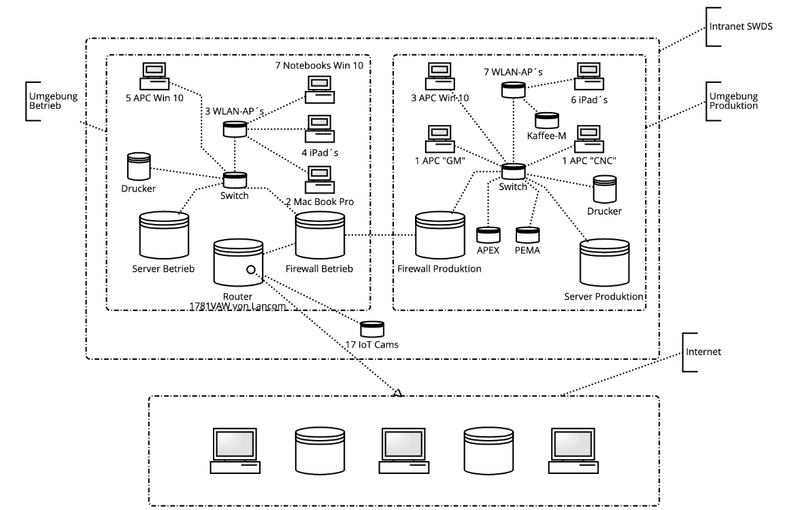

*Abbildung 37: Netzplan der SWDS Werft. Quelle: Informationen Werft, Abbildung 5*

Da IDS, WLAN Controller und zentrale Geräteverwaltung in der Systemliste der Werft nicht aufgeführt sind, wird für den Ausgangszustand der Beispielrechnung ein Betrieb ohne diese Komponenten angenommen.

### 7.2 Bewertetes Risikoszenario

Für die ROSI wird ein erfolgreicher Folgeangriff betrachtet. Ein Angreifer erfasst über einen Rogue Access Point oder ARP Spoofing Anmeldedaten oder verwertbare Kommunikationsdaten. Diese Informationen werden anschließend für einen unberechtigten Zugriff auf Dateiablagen, Active Directory, DNS oder Produktionsdaten verwendet.

Der praktische Versuch bildet den ersten technischen Schritt des Risikoszenarios ab. Für die wirtschaftliche Bewertung wird ergänzend ein erfolgreicher Folgeangriff auf zentrale Daten oder Systeme als Modellannahme angesetzt.

Das Schadenspotenzial ergibt sich aus folgenden Informationen der Werft Unterlage.

1. Die Fertigung ist der umsatzrelevante Kernprozess.
2. Produktionsdaten für CNC und Pläne liegen auf einer Server VM.
3. Delfship wird im Produktionsbereich eingesetzt.
4. Active Directory und DNS sind zentrale Dienste im Betriebsnetz.
5. Zehn WLAN Access Points und mehrere mobile Geräte vergrößern die WLAN Angriffsfläche.
6. Die CNC Fräse verwendet Windows 7 Pro.
7. Der Produktionsserver verwendet Windows Server 2012 R2.
8. Im Netzplan sind 17 IoT Kameras eingezeichnet.

Entlastend wirken die Trennung von Produktion und Betrieb, die beiden Firewalls und die verschlüsselten Sicherungen.

### 7.3 Asset Value und Schaden je Vorfall

Für die Formel wird der Asset Value als finanzielle Auswirkung eines erfolgreichen Vorfalls angesetzt. Dieser Wert entspricht hier der Single Loss Expectancy. Die Beträge werden als transparente Annahmen für die Lehrrechnung ausgewiesen.

| Schadensposition | Annahme | Begründung |
|---|---:|---|
| Technische Analyse und Forensik | 25.000 € | Externe Analyse, Beweissicherung und Untersuchung mehrerer Netzbereiche |
| Produktionsausfall | 36.000 € | Drei angenommene Ausfalltage mit 12.000 € je Tag |
| Wiederherstellung und Prüfung von Produktionsdaten | 24.000 € | Kontrolle von CNC Daten, Plänen und Delfship Daten |
| Lieferverzug und Reputationsschaden | 30.000 € | Verzögerte Aufträge und zusätzliche Kundenkommunikation |
| Reaktion auf kompromittierte Konten und Daten | 20.000 € | Passwortwechsel und Prüfung von Dateiablage, AD und DNS |
| Datenschutz und rechtliche Beratung | 15.000 € | Prüfung von Meldepflichten und mögliche Folgekosten |
| **Gesamtschaden je Vorfall** | **150.000 €** | Summe der angenommenen Positionen |

Die Annahme von drei Ausfalltagen berücksichtigt die vorhandenen Sicherungen. Für eine reale Entscheidung wird der angenommene Wert von 12.000 € pro Produktionstag durch die Kennzahl der Werft ersetzt.

### 7.4 Jährliche Eintrittswahrscheinlichkeit

Für den Ausgangszustand wird in der Lehrrechnung eine jährliche Wahrscheinlichkeit von 35 % angesetzt. Die Schätzung berücksichtigt die zehn WLAN Access Points, die mobilen Geräte, die älteren Systeme und den angenommenen Betrieb ohne zusätzliches IDS. Die vorhandenen Firewalls, die Segmentierung und die Sicherungen reduzieren das Gesamtrisiko bereits.

Nach Einführung der Maßnahmen wird eine jährliche Wahrscheinlichkeit von 8 % angenommen. Berücksichtigt werden verwaltete WLAN Profile, geschützte Management Frames, Dynamic ARP Inspection, DHCP Snooping, Suricata, arpwatch, regelmäßige Protokollauswertung und Schulung.

| Zustand | Wahrscheinlichkeit | Einordnung |
|---|---:|---|
| Vor den Maßnahmen | 0,35 | Begründete Annahme ohne historische Vorfalldaten |
| Nach den Maßnahmen | 0,08 | Begründete Annahme mit Prävention, Erkennung und Reaktion |
| Absolute Risikoreduktion | 0,27 | `0,35 - 0,08` |
| Relative Risikoreduktion | 77,1 % | `0,27 / 0,35` |

### 7.5 Erwarteter jährlicher Verlust

Der erwartete jährliche Verlust wird als Annual Loss Expectancy berechnet.

```text
ALE = jährliche Eintrittswahrscheinlichkeit × Schaden je Vorfall
```

Vor den Maßnahmen:

```text
ALE vorher = 0,35 × 150.000 €
ALE vorher = 52.500 € pro Jahr
```

Nach den Maßnahmen:

```text
ALE nachher = 0,08 × 150.000 €
ALE nachher = 12.000 € pro Jahr
```

| Zustand | Wahrscheinlichkeit | Schaden je Vorfall | ALE |
|---|---:|---:|---:|
| Vor den Maßnahmen | 0,35 | 150.000 € | 52.500 € |
| Nach den Maßnahmen | 0,08 | 150.000 € | 12.000 € |
| Vermiedener jährlicher Verlust | 0,27 | 150.000 € | 40.500 € |

### 7.6 Kosten der Maßnahmen

Für die Kostenrechnung wird ein angenommener Stundensatz von 80 € verwendet.

| Kostenposition | Rechnung | Jahr 1 | Folgejahr |
|---|---:|---:|---:|
| Monitoring Host und Speicher | Pauschal | 1.200 € | 0 € |
| Suricata und arpwatch einrichten | 40 Stunden × 80 € | 3.200 € | 0 € |
| Switch und Firewall Konfiguration | 12 Stunden × 80 € | 960 € | 0 € |
| WLAN Profile und Management Frame Schutz | 12 Stunden × 80 € | 960 € | 0 € |
| Schulung | 8 Stunden × 80 € | 640 € | 0 € |
| Alert Auswertung und Betrieb | 1,5 Stunden × 52 Wochen × 80 € | 6.240 € | 6.240 € |
| Regelpflege und jährlicher Test | 8 Stunden × 80 € | 640 € | 640 € |
| **Gesamtkosten** |  | **13.840 €** | **6.880 €** |

Für Suricata und arpwatch werden keine Lizenzkosten angesetzt. Zusätzliche Kosten für neue Switches oder einen WLAN Controller können nach der technischen Bestandsprüfung ergänzt werden.

Die HP 2530 Switch Serie unterstützt Dynamic ARP Protection und DHCP Snooping grundsätzlich, allerdings erst ab Firmware Version YA.15.13.0003, ältere Firmware Stände unterstützen diese Funktionen nicht. Bei PoE Varianten der Serie ist die Unterstützung zusätzlich eingeschränkt. Ob die bei der SWDS Werft eingesetzten Switches die passende Firmware und Variante besitzen, ist mit der vorliegenden Unterlage nicht feststellbar.

Quelle: [HP 2530 Switch Series Manual Supplement, Dynamic ARP Protection](https://www.manualslib.com/manual/1191512/Hp-2530.html?page=15), [HP 2530 Switch Series Manual Supplement, Enabling DHCP Snooping](https://www.manualslib.com/manual/1191512/Hp-2530.html?page=8), [HPE Support, Aruba 2530 Switch Series: DHCP Snooping Commands are not Available](https://support.hpe.com/hpesc/public/docDisplay?docId=sf000057024en_us&docLocale=en_US)

> [PLATZHALTER: Firmware Version und PoE Variante der eingesetzten HP 2530 Switches bei der Werft prüfen. Nur falls eine Firmware Aktualisierung oder ein Austausch nötig ist, zusätzliche Kosten ergänzen und die ROSI neu berechnen.]

### 7.7 ROSI im ersten Jahr

Die Projektaufgabe gibt folgende Formel vor.

```text
ROSI = (Risk Reduction × Asset Value - Cost) / Cost
```

Im Basisfall beträgt die absolute Risikoreduktion `0,27`. Der Asset Value beträgt 150.000 €. Das Produkt entspricht einem vermiedenen jährlichen Verlust von 40.500 €.

```text
ROSI Jahr 1 = (0,27 × 150.000 € - 13.840 €) / 13.840 €
ROSI Jahr 1 = (40.500 € - 13.840 €) / 13.840 €
ROSI Jahr 1 = 1,93
ROSI Jahr 1 = 193 %
```

Ein ROSI von 193 % bedeutet, dass der angenommene wirtschaftliche Überschuss nach Abzug der Maßnahmenkosten dem 1,93 fachen der Investition entspricht.

### 7.8 ROSI der Folgejahre und Amortisation

Ab dem zweiten Jahr werden nur die laufenden Kosten angesetzt.

```text
ROSI Folgejahr = (40.500 € - 6.880 €) / 6.880 €
ROSI Folgejahr = 4,89
ROSI Folgejahr = 489 %
```

Die rechnerische Amortisationszeit im ersten Jahr beträgt rund 4,1 Monate.

```text
Amortisationszeit = 13.840 € / 40.500 € × 12 Monate
Amortisationszeit = 4,1 Monate
```

Über drei Jahre werden 121.500 € erwarteter Verlust vermieden. Die Gesamtkosten betragen 27.600 €.

```text
Kosten über drei Jahre = 13.840 € + 6.880 € + 6.880 €
Kosten über drei Jahre = 27.600 €

ROSI drei Jahre = (121.500 € - 27.600 €) / 27.600 €
ROSI drei Jahre = 3,40
ROSI drei Jahre = 340 %
```

### 7.9 Sensitivitätsanalyse

Mit einer Sensitivitätsanalyse wird geprüft, wie sich unterschiedliche Wahrscheinlichkeiten auf das Ergebnis auswirken. Der angenommene Schaden von 150.000 € und die Kosten des ersten Jahres bleiben dabei gleich.

| Szenario | Wahrscheinlichkeit vorher | Wahrscheinlichkeit nachher | Vermiedener Verlust | ROSI Jahr 1 |
|---|---:|---:|---:|---:|
| Konservativ | 0,25 | 0,12 | 19.500 € | 41 % |
| Basisfall | 0,35 | 0,08 | 40.500 € | 193 % |
| Hohe Gefährdung | 0,40 | 0,06 | 51.000 € | 268 % |

Auch im konservativen Szenario bleibt der ROSI positiv. Das Ergebnis hängt weiterhin von den geschätzten Kosten, dem Schaden pro Vorfall und den Wahrscheinlichkeiten ab.

### 7.10 Empfehlung für die SWDS Werft

Im Basisfall sinkt der erwartete jährliche Verlust von 52.500 € auf 12.000 €. Den Kosten von 13.840 € im ersten Jahr steht eine erwartete Risikoreduktion von 40.500 € gegenüber. Der ROSI beträgt rund 193 %.

Priorität haben verwaltete WLAN Profile, geschützte Management Frames, Schutz vor manipulierten ARP Antworten und ein laufend ausgewertetes IDS. Zusätzlich werden die älteren Systeme in die Maßnahmenplanung einbezogen. Die vorhandenen verschlüsselten Sicherungen werden regelmäßig durch Rücksicherungstests geprüft.

Für eine reale Investitionsentscheidung muss die Werft die angenommenen Werte durch eigene Kennzahlen ersetzen. Die Rechenmethode bleibt dabei unverändert.

## 8. Fazit

Der WiFi Pineapple wurde eingerichtet und sendete einen offenen Access Point mit der SSID `HTW-Guest`. Ein WLAN Endgerät verband sich mit diesem Zugangspunkt und erhielt die Adresse `172.16.42.154`. Die auf dem Pineapple erstellte Paketaufzeichnung zeigte wiederholte DNS Anfragen des Endgeräts an `172.16.42.1`. Damit wurden der Verbindungsaufbau und die Sichtbarkeit des erzeugten Netzwerkverkehrs nachvollziehbar dargestellt.

Der Datenverkehr des verbundenen WLAN Endgeräts wurde mit `tcpdump` direkt auf der Bridge `br-lan` des WiFi Pineapple aufgezeichnet.

Beim ARP Spoofing erzeugte Kali fortlaufend gefälschte Antworten für das Gateway und das Windows Testsystem. Die beiden gleichzeitig ausgeführten Prozesse bildeten beide Kommunikationsrichtungen ab. Die abschließende Kontrolle der übernommenen ARP Zuordnungen und des weitergeleiteten Testverkehrs wird mit den gekennzeichneten Messwerten ergänzt.

Suricata wurde installiert, als Dienst eingerichtet und mit einem allgemeinen Smoke Test geprüft. Sechs eigene Regeln bilden die vorgesehenen Erkennungsfälle für HTTP, DNS und ARP ab. arpwatch ergänzt die Überwachung der IP und MAC Zuordnungen. Das Schutzkonzept wird durch eine Firewall Whitelist, feste ARP Einträge und organisatorische Maßnahmen vervollständigt. Die Wirksamkeit dieser Maßnahmen wird in diesem Projekt konzeptionell begründet und nicht durch eigene Testergebnisse belegt.

Die wirtschaftliche Bewertung überträgt die technischen Risiken auf die SWDS Werft. Im Basisfall ergibt sich für das erste Jahr ein ROSI von 193 %. Die Sensitivitätsanalyse zeigt auch im konservativen Szenario einen positiven Wert. Sämtliche finanziellen Parameter sind als Annahmen ausgewiesen und können durch unternehmenseigene Kennzahlen ersetzt werden.

## 9. Anhang

### 9.1 Kontrollpunkte vor der Abgabe

| Bereich | Bereits enthalten | Vor der Abgabe zu prüfen oder zu ergänzen |
|---|---|---|
| Formalia | Titel, Modul, Hochschule, Gruppe und Bearbeitungszeitraum | Namen und Matrikelnummern, Zeitplan, Meilensteine, Aufgabenzuordnung und Quellenverzeichnis |
| WLAN Endgerät | Verbindung mit `HTW-Guest`, Adresse `172.16.42.154` und DNS Auswertung | Gerätetyp und Betriebssystem sowie Bestätigung, ob die Verbindung über Evil WPA automatisch oder nach manueller Auswahl erfolgte |
| Internes Testnetz | IP Konfigurationen und erfolgreiche Verbindungstests zu Ubuntu und Windows | Bezeichnung, Gerätetyp und MAC Adresse des Gateways sowie Verbindungstest zu `192.168.30.1` |
| Rogue Access Point | Recon, Open AP Konfiguration, sichtbarer Access Point und verbundener Client | Nachweise für den echten mobilen Hotspot, den PineAP Pool, die aktivierten PineAP Optionen, Evil WPA und den Deauthentication Versuch |
| Rogue Access Point PCAP | Übertragung der Datei und DNS Auswertung in Wireshark | `rogue_ap_01.pcap` beifügen, SHA256 Wert ergänzen und den personenbezogenen Windows Pfad im Text sowie in den Abbildungen 32 und 33 anonymisieren |
| ARP Spoofing | Aktivierte IP Weiterleitung und zwei gleichzeitig laufende `arpspoof` Prozesse | `arpspoofing_01.pcap`, Wireshark Ansicht, ARP Tabellen von Windows und Gateway, weitergeleiteten Testverkehr sowie Wiederherstellung der ARP Zuordnungen ergänzen |
| Suricata | Installation, Smoke Test, Konfiguration und eigenes Regelkonzept | Testdomain für R5 festlegen und die überholten Platzhalter zum Interface sowie zum Klammerabschluss von R4 entfernen |
| Schutzmaßnahmen | Suricata, arpwatch, Firewall Konzept, statischer ARP Eintrag und weitere Maßnahmen | Die theoretische Behandlung ist abgestimmt. Ein praktischer Nachweis ist nicht erforderlich |
| ROSI | Datengrundlage der Werft, ausgewiesene Annahmen, Berechnung und Sensitivitätsanalyse | Firmware und PoE Variante der HP 2530 Switches nur prüfen, wenn der entsprechende Absatz und mögliche Zusatzkosten Bestandteil der Abgabe bleiben |
| Abgabedateien | Abschlussbericht mit Abbildungen | PCAP Dateien und das gesondert geforderte Poster vollständig beifügen |
